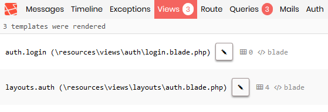

# laravel-debugbar-vscode

This package code is based on https://github.com/barryvdh/laravel-debugbar
## Warning: still on development

Plugin **laravel-debugbar** that provide **button** to open **vscode**

## How to use

Move mouse pointer to text that contains file path, then the button will appear. Click to open the path in vscode :D




Laravel 5.5 uses Package Auto-Discovery, so doesn't require you to manually add the ServiceProvider.

## Installation

Require this package with composer. It is recommended to only require the package for development.

```shell
composer require erlangparasu/laravel-debugbar-vscode --dev
```

### Laravel 5.5+:

If you don't use auto-discovery, add the ServiceProvider to the providers array in config/app.php

```php
ErlangParasu\DebugbarVscode\ServiceProvider::class,
```

Copy the package config to your local config with the publish command:

```shell
php artisan vendor:publish --provider="ErlangParasu\DebugbarVscode\ServiceProvider"
```

### Lumen:

For Lumen, register a different Provider in `bootstrap/app.php`:

```php
if (env('APP_DEBUG')) {
    $app->register(ErlangParasu\DebugbarVscode\LumenServiceProvider::class);
}
```
